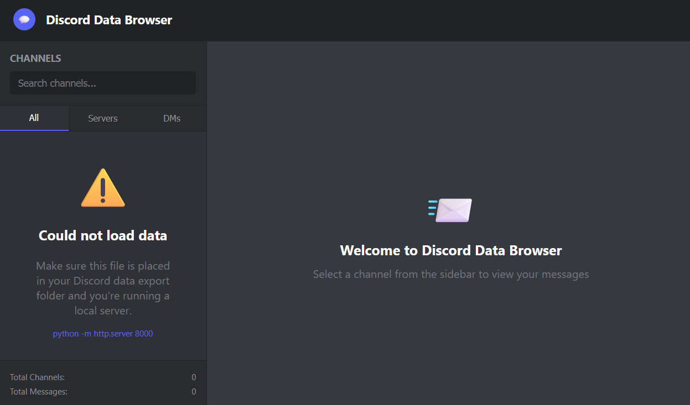

<p align="center">
  
</p>

<h1 align="center">Discord Data Browser</h1>

<p align="center">
  <strong>A simple, local-first web interface to browse and read your Discord data export — no uploads or external servers required.</strong>
</p>

<p align="center">
  
  
  
  
  
  
</p>

<p align="center">
  <a href="https://anahatmudgal.com">Author Website</a> •
  <a href="https://github.com/anahatm">GitHub</a>
</p>

---

## What is Discord Data Browser?

Discord Data Browser is a **lightweight, privacy-focused HTML viewer** that lets you browse your Discord data export locally in your web browser. It provides a familiar Discord-like interface to explore your messages, DMs, and server channels.

Your data **never leaves your computer** — everything runs locally in your browser with no external requests or uploads.

---

## Features

- **🔒 100% Local & Private** — Your data stays on your machine. No uploads, no tracking, no external servers.
- **💬 Discord-Style Interface** — Familiar dark theme UI that feels like Discord
- **📂 Browse All Channels** — View messages from servers and DMs in one place
- **🔍 Search & Filter** — Search channels by name, filter by servers or DMs
- **📊 Statistics** — See total channel and message counts at a glance
- **📱 Responsive** — Works on desktop and mobile browsers
- **⚡ Zero Dependencies** — Single HTML file, no build tools or npm required

---

## Screenshots

<p align="center">
  
</p>

---

## Quick Start

### 1. Request Your Discord Data

1. Open Discord and go to **Settings** → **Privacy & Safety**
2. Scroll down and click **Request all of my Data**
3. Wait for Discord to email you (can take up to 30 days)
4. Download and extract the ZIP file

### 2. Add the Viewer

Copy `index.html` from this repository into your extracted Discord data folder (the folder containing `Messages/`, `Account/`, etc.)

```
your-discord-package/
├── Account/
├── Messages/
├── Servers/
├── index.html  ← Place it here
└── ...
```

### 3. Start a Local Server

Due to browser security restrictions, you need to run a local web server. Open a terminal in your Discord data folder and run:

**Python 3:**

```bash
python -m http.server 8000
```

**Python 2:**

```bash
python -m SimpleHTTPServer 8000
```

**Node.js (with npx):**

```bash
npx serve
```

**PHP:**

```bash
php -S localhost:8000
```

### 4. Open in Browser

Navigate to **http://localhost:8000** in your web browser.

---

## Usage

- **Browse Channels** — Click on any channel in the sidebar to view messages
- **Filter** — Use the tabs (All / Servers / DMs) to filter channel types
- **Search** — Type in the search box to find specific channels
- **View Messages** — Messages are displayed in chronological order with timestamps

---

## Why Use This?

Discord's data export is just a bunch of JSON files, which can be hard to read. This tool gives you:

- A **visual interface** instead of raw JSON
- **Organized browsing** instead of navigating folder structures
- **Quick access** to all your conversations in one place
- **Complete privacy** — unlike online viewers that require uploads

---

## Privacy & Security

- ✅ **Runs entirely in your browser** — no server-side processing
- ✅ **No external requests** — no analytics, no CDNs, no tracking
- ✅ **No data collection** — your messages are never sent anywhere
- ✅ **Open source** — inspect the code yourself

---

## Technical Details

- **Single HTML file** — Easy to distribute and use
- **Vanilla JavaScript** — No frameworks or build tools needed
- **CSS Variables** — Customizable theming
- **Fetch API** — Loads JSON files from your local server
- **ES6+** — Modern JavaScript for clean, readable code

---

## Limitations

- Only displays **your own messages** (Discord exports only include messages you sent)
- Requires a **local HTTP server** (browser security prevents loading local JSON files directly)
- **Attachments** are listed but not displayed (Discord exports don't include media files)

---

## Contributing

Contributions are welcome! Feel free to open issues or submit pull requests.

---

## Author

**Anahat Mudgal**

- Website: [anahatmudgal.com](https://anahatmudgal.com)
- GitHub: [@anahatm](https://github.com/anahatm)

---

## License

This project is open source and available under the [MIT License](LICENSE).
